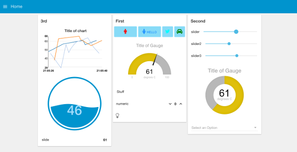

# NodeRED

### What is NodeRED?

NodeRED is a graphical data-driven programming tool built on the NodeJS JavaScript runtime. To use it, the user imports libraries of nodes and connects these nodes together to implement logic.&#x20;

<figure><figcaption></figcaption></figure>

A node that will be used frequently in these labs is the MQTT In node, which allows the user to subscribe to MQTT topics and handle the data that is being subscribed to each topic.

<figure><figcaption></figcaption></figure>

Data is stored in the **msg** object and passed from node-to-node. Most of the useful data can be found in the **payload field** of the **msg object**, which can be parsed out using the . operator inside a custom **function** node.

<figure><figcaption></figcaption></figure>

```javascript
msg.payload = "My Data";
let myData = msg.payload;

return msg;
```

Since NodeJS is a JavaScript runtime, the programming language used inside function blocks to implement logic is JavaScript. One of the immediately observable differences between JavaScript, and a language that you are familiar with like C++, is that JavaScript uses type inference. This means that you do not have to specify a variable as an integer, string, or floating-point number. It is all handled behind the scenes.

### Visualizing Data

A popular extension for NodeRED is node-red-dashboard. What it does is it implements easy-to-use nodes that create interactive elements in a dashboard UI.

<figure><figcaption></figcaption></figure>

### Exporting Flows

While flows can be saved within NodeRED, they can also be exported into a text format called JSON. This JSON file can then be loaded onto another PC or saved for the future.

