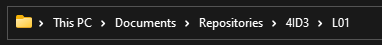

# L01\_WiFi

### Objective 

A practice-based understanding on the “things” of the Internet of Things, and the “Internet” of the Internet of Things, including temperature, pressure, humidity, and light intensity sensors, connected to ESP 8266 microcontroller (with Publication-Subscription client), communicating over 802.11ah WiFi to an MQTT server on cloud, corresponding with Node-Red application, showcasing outcome in a Node-Red user interface.

### Feedback 

Q1 - What would you rate the difficulty of this lab?

_(1 = easy, 5 = difficult)_

| **1** | **2** | **3** | **4** | **5** |
| ----- | ----- | ----- | ----- | ----- |

Comments about the difficulty of the lab:

Q2 - Did you have enough time to complete the lab within the designated lab time?

Q3 - How easy were the lab instructions to understand?

_(1 = easy, 5 = unclear)_

| **1** | **2** | **3** | **4** | **5** |
| ----- | ----- | ----- | ----- | ----- |

List any unclear steps:

Q4 - Could you see yourself using the skills learned in this lab to tackle future engineering challenges?

_(1 = no, 5 = yes)_

| **1** | **2** | **3** | **4** | **5** |
| ----- | ----- | ----- | ----- | ----- |

### &#x20;

### Setting up the Workspace 

Each lab, we will be creating a new folder in the local git repository that was created in the provided pre-lab to store and document technologies that you have worked on.

Navigate to your local git repository for this course.

Create a new folder named **L01**. Navigate inside this folder.

Create a new text file in the folder.

Press **File > Save as.**

Save it as **L01.md**. Ensure that the **Save as type** is set to **All files (\*.\*)**.

Now, you should have two files, a **text file** and a **markdown file**. Delete the text file.

To open the markdown file, **right-click** and select **Open with**. Choose **Notepad**.

Writing markdown documents to explain your code is very similar to HTML. A reference guide can be found here:

[https://docs.github.com/en/get-started/writing-on-github/getting-started-with-writing-and-formatting-on-github/basic-writing-and-formatting-syntax](https://docs.github.com/en/get-started/writing-on-github/getting-started-with-writing-and-formatting-on-github/basic-writing-and-formatting-syntax)

Write the following text in the markdown file and save it.

**Right-click** in the root of your local repository and launch **git bash**.

First, we need to add all the changes to the index that will be synced with GitHub. This will be done with the git add command.

_git add ._

The period ‘.’ Is used as a shorthand for selecting all changes.

Next, when we are happy with the changes we chose to upload, we can use the commit command to package them to be synced.

_git commit -m “Lab 1 folder”_

The ‘-m’ flag stands for message, and it adds a message that explains what changes were made.

Lastly, to sync your local git repository with GitHub, use the git push command.

_git push origin main_

Now, log into GitHub and verify that the changes have been made.

Now, if you are collaborating and wish to sync your local git repo with the remote GitHub repo, use the git pull command. In this case, we see that our local git repo is already up-to-date.

### Wiring Diagram 

ESP8266 Development Board Pinout:

BMP180 Connection:

BH1750 Connection:

DHT11 Connection _(Except connect DHT11 signal pin to D5)_ :

### Reading Sensor Data 

The goal of this section of the lab is to read data from 3 sensors and print them to the serial monitor, before we communicate to a server.

Launch the Arduino IDE and **Save as** into your lab 1 folder.

 

The 3 sensors we will be using are as follows:

* DHT11 for Temperature and Humidity
* BMP180 for Pressure
* BH1750 for Light Intensity

Ensure that the following libraries are installed from the **Arduino Library Manager**:

* Adafruit Unified Sensor by Adafruit
* Adafruit BMP085 Unified by Adafruit
* Hp\_BH1750 by Stefan Armborst
* PubSubClient by Nick O’Leary
* The ESP8266 driver as described in the pre-lab

Create a new header file. Name this file **L01.h**.

In this file, we will keep our dependencies, preprocessor macros, global variables, and global objects.

Include the libraries for each sensor. Don’t worry about including the same one twice, the #ifndef directives will prevent the compiler from looking at the same library twice.

Include any macros that you need. Macros act as a find-and-replace. The C++ preprocessor will copy ‘14’ everywhere in the code where ‘DHTPIN’ is found at compile time.

Lastly, lets instantiate some global objects for classes that we will be using throughout the code.

This concludes the header file. Let’s move back to the implementation file.

Firstly, include our header file.

Next, set up the void setup() function.

Moving onto the void loop() function, it should be noticed that both the DHT sensor and BMP sensor are part of the same Adafruit unified library, so they will be polled differently than the BH sensor.

Next, we want to print the sensor readings to the serial monitor.

This is a shorthand for a one line if-else statement. It is called a ternary statement.

Firstly, we are checking if there is a value stored in each event attribute or if the sensor failed to retrieve a value.

If **isnan()** is **True** then there is **no value** stored. Because we want the opposite condition, we will place a **not operator** ‘!’ in front of the condition.

The **?** operator separates the comparison from the true condition.

The **:** operator separates the true statement from the false statement.

_(condition) ? If true : If false_

(If we have a temperature value) ? Print the temperature value : Print that the sensor is disconnected

Secondly, to concatenate different datatypes into a print statement, we must **cast them to strings** and **concatenate them** together. An easy way to do this is to use **String**(float value) to cast and **+** operator to concatenate two strings together.

Thirdly, when printing to the serial monitor, the **print()** command does not include a newline character. In order to print on a new line, we could add it in **print(string + ‘\n’)** or use the **println()** function.

Lastly, we want to let time pass between polls. This can be done simply by adding a delay in the loop.

To upload to the board, change the board to Generic ESP8266 Module.

Leave the default communication settings the same, with the exception of the COM port. Select the COM port that your microcontroller is connected to.

Press the **upload** button to compile and upload the code. Keep an eye on the terminal window for any errors that arise.

A successful upload should look like this:

After the upload is complete (NOT DURING), launch the **Serial monitor** to view the microcontroller output.

### Publishing to an MQTT Broker 

The ESP8266 has a built-in WiFi transceiver, which __ allows it to connect to the internet easily. We will be using the PubSubClient library to:

1. Connect to a local WiFi network
2. Connect to a public (or private) MQTT broker
3. Connect to a NodeRED interface

Modify your header file to include some **global variables** for the WiFi driver, the **MQTT libraries**, and instantiate **the MQTT Client** object. Also change the delay to 20 seconds (20,000 ms).

When adding the broker ip address, you have two options:

1. Use an online public broker
2. Use a local broker on the same network

### Public Broker (Easy Way) 

Use the IP address of a known public broker such as Mosquitto’s test broker:

_test.mosquitto.org_

_Port is 1883_

### Local Broker (Hard Way) 

To start a broker on your local network, navigate to the Mosquitto MQTT broker install directory and perform the following instructions.

Navigate to the install directory of the Mosquitto broker and open the **mosquitto.conf** file in a text editor.

Use **CTRL + F** to search for **allow\_anonymous**. **Uncomment it** and change it from false to **true**.

Ensure that windows **firewall** is **disabled**.

_.#mosquitto.exe -c mosquitto.conf -v_

The -p flag is used to explicitly specify a port if the default port is in use.

Use **ifconfig** to find your PC’s local address.

Use these when setting configuring the server **ip** and **port** in your code.

### &#x20;

### Hotspotting your Microcontroller

Open **Windows Mobile Hotspot**.

Set your login credentials.

Toggle it **on** and **disable power saving**.

### Code Changes 

In the **setup()** function, we need to initialize the WiFi driver and MQTT client.

If the microcontroller loses connection to the MQTT server, we want to have a callback function that would attempt to reconnect.

Below the setup() function, create a reconnect function. This function will be called from void loop().

In void loop(), if connection is lost then call the reconnect function. Once you are connected, publish each sensor data to its associated topic.

Ensure the code compiles and reupload the modified code to the microcontroller.

### Verifying Connection 

We will be using 2 different devices and applications to verify that the data is being published to the corresponding topics.

1. Using the Mosquitto terminal application
2. Using a mobile application

### Mosquitto Terminal Application 

Open Powershell and navigate to the install directory of the Mosquitto MQTT broker, that was installed in the pre-lab.

Launch the subscribe applications with the following flags:

_-h - MQTT broker IP address_

_-t - the topic that your wish to connect to_

After waiting a period of time, you should see the values being printed to the terminal window every 20 seconds.

### Using a Mobile Application 

The phone application will likely be delayed from when the terminal application receives the message. If you are using iOS, install the following app:

Next, connect to the public mosquito broker:

Next, subscribe to the topic of choice.

Lastly, wait for values to populate.

You can also try it with other sensor readings to ensure all of them are working correctly.

### NodeRED Dashboard 

Please follow the pre-lab instructions to install NodeRED.

To start NodeRED, open Powershell and type the command:

_node-red_

Navigate to the URL presented, in a web browser.

Filter nodes to find the **mqtt in** node and the **debug** node. Drag them into your flow diagram.

Click on the **mqtt in** node to begin editing its configuration.

Fill in the information for the public broker.

Press **Update**.

Under **Properties** fill in the **Topic** field.

Enable the **debug** node by pressing the **green box**.

Lastly, press **Deploy** and watch the **Debug Panel** populate with sensor values.

### Visualizing NodeRED Data 

In the pre-lab, the node-red-dashboard add-on was installed which enables us to create a dashboard of graphs, charts, and toggles to visualize and control data.

In the **filter nodes** field, search for **chart** and drag it into your flow diagram.

When you click on the node, you will need to create a new **Dashboard Tab**. Use the default name and press **Add**.

Add the dashboard group to that new dashboard by pressing **Add**.

Lastly, edit the chart node to visualize your data nicely. Press **Done** when complete.

Connect your **mqtt in** node to the input of your **chart** node. Press **Deploy** to save changes.

To view the dashboard, either append **ui/** to your url ([http://localhost:1880/ui](http://localhost:1880/ui)) or press the **open dashboard** icon in the top right corner of the dashboard panel.

Wait for data to populate.

Now that you have seen how to visualize one topic, attempt to visualize the rest.

The resultant flow should look like this:

If values are not showing up, ensure that your y-axis scale is correct.

### Saving and Pushing Your Project 

### Exporting a NodeRED Flow as JSON 

Click on the **hamburger menu** and select **export**.

Select **current flow**.

Select **JSON**.

Press **Download**.

Cut and paste the **flows.json** file from your **Downloads/** folder to the **L01** folder in the **local repo.**

### Committing and Pushing Changes to GitHub 

Click on the little **folder icon** in the **navigation bar** to view to **path**.

Copy this path to clipboard.

Open **Git Bash**.

Use the **cd** command to change directories into the L01 folder.

Go back one directory using the **cd ..** command. You should be in the **4ID3 folder** now.

Add all the new changes using the **git add .** command.

Commit the changes using the **git commit -m “”** command. Use a message that represents what has been changed since the previous commit.

Push the changes in the **main branch** of your **local repo** to the remote **GitHub repo** named **origin**.

Log into your GitHub account to verify that all changes have been uploaded.
